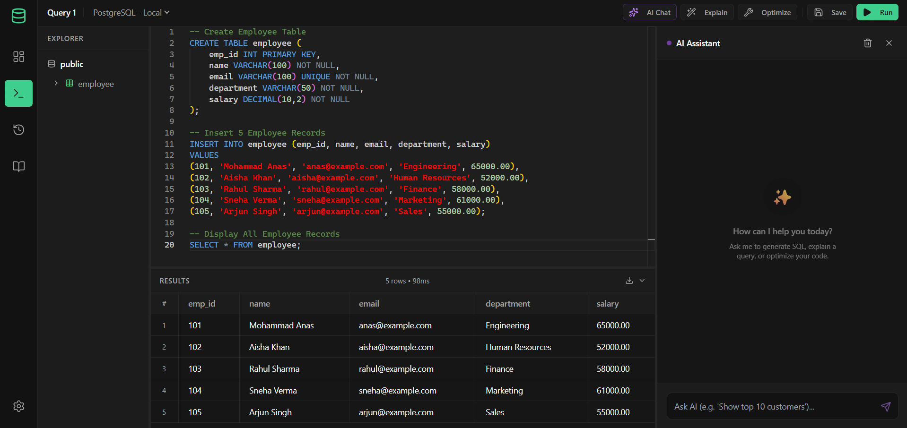
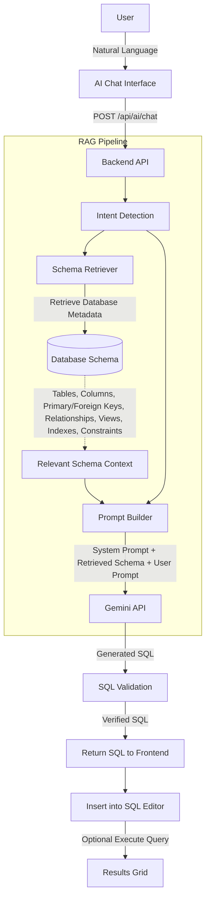
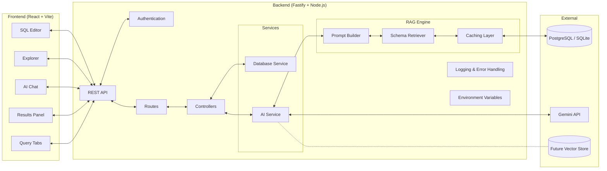
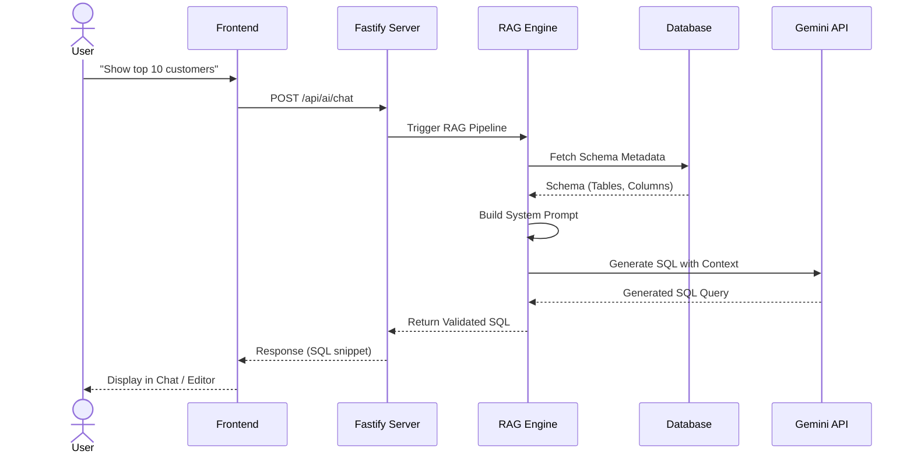
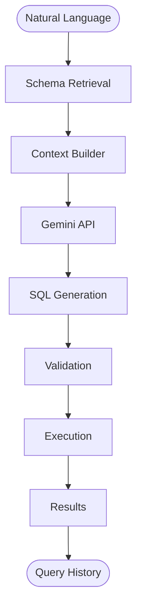

# SQLStudio

A web-based SQL IDE. Write, run, save, and track SQL queries against a real database engine, right in the browser.



## Features

- **Monaco editor**: SQL syntax highlighting, autocomplete, dark mode.
- **Real database execution**: runs raw SQL against a persistent SQLite backend.
- **Schema explorer**: browse tables, columns, and primary keys from the live schema.
- **Query history**: every execution is logged with status, execution time, and timestamp.
- **Saved queries**: save snippets into collections, re-run them with one click.
- **Dashboard**: connection counts, active users, query metrics, recent activity.
- **Dark mode by default**, styled with plain CSS tokens, loosely modeled on VS Code, DataGrip, and Supabase Studio.
- **Run selected query**: highlight part of a script and run just that selection, without executing the whole file.
- **File and folder management**: create, rename, and delete files/folders in the workspace explorer, backed by an API that keeps everything scoped to the workspace folder.
- **Integrated terminal**: a real shell (xterm.js + node-pty), running in the workspace directory. This is a full, unrestricted shell — not a sandboxed command runner — so anything typed into it runs directly on your machine, the same as opening a normal terminal. Local-only, not exposed on the network.
- **Git integration**: init, status, add, commit, log, branch, checkout, diff, and push to GitHub, all scoped to the user's own workspace folder, separate from the app's own codebase.
### Git integration, in more detail
 
Each user's workspace maps to its own folder on disk (e.g. under Desktop), kept separate from the application's source code. Git operations run through `simple-git`, a typed Node.js library, instead of shell string commands — that avoids the command injection risk you'd get from building shell commands out of user input.
 
Supported: `init`, `status`, `add`, `commit`, `log`, `branch`, `checkout`, `diff`, `remote`, `push`.
 
This is built for **local, single-user use**. There's no per-user sandboxing or container isolation — if you deploy this for multiple people or expose it on a network, the terminal and git features would need a real security review first (containerized shells, path validation, auth on pushes, etc.). As a local dev tool, this setup is fine.

## Performance benchmarks

From load testing on the Fastify + SQLite/PGlite stack:

- **Data capacity**: handles 1,000,000-5,000,000 records per table with indexed columns.
- **Database latency**: 10-30ms for indexed read/write queries.
- **API throughput**: 100-250 concurrent requests per second.
- **Under load**: p99 response time stays under 200ms (tested with k6/autocannon) before rate limiting kicks in.
- **AI SQL generation**: 1.5-3.0 seconds, depending on the Gemini API.


## AI RAG workflow

The IDE uses retrieval-augmented generation to turn natural language into SQL, using the current database schema as context.



**Workflow stages:**
- **Schema retriever**: pulls the active schema and metadata (tables, columns, relations) so the model isn't guessing at structure.
- **Prompt builder**: puts together a system prompt with the schema and execution instructions.
- **Gemini API**: generates SQL from the prompt.
- **Validation and execution**: the generated query gets checked, then handed to the Monaco editor for the user to run.

## Architecture



## Request lifecycle



## Folder structure

```text
backend/
├── src/
│   ├── config/
│   │   └── env.ts
│   ├── controllers/
│   │   └── ai.controller.ts
│   ├── rag/
│   │   ├── promptBuilder.ts
│   │   └── schemaRetriever.ts
│   ├── routes/
│   │   └── ai.routes.ts
│   ├── services/
│   │   └── ai.service.ts
│   ├── database.ts
│   ├── index.ts
│   ├── seed.ts
│   └── seed-metadata.ts
├── prisma/
│   └── schema.prisma
└── package.json

frontend/
├── src/
│   ├── components/
│   │   ├── chat/
│   │   │   ├── AIChatSidebar.tsx
│   │   │   └── ChatMessage.tsx
│   │   └── ui/
│   ├── pages/
│   │   └── SQLWorkspace.tsx
│   ├── store/
│   └── index.css
└── package.json
```

## AI request pipeline



## Technology stack

| Category | Technology | Notes |
| :--- | :--- | :--- |
| Frontend | React 18, Vite, TypeScript | SPA with fast HMR |
| Styling | Tailwind CSS, Lucide Icons | Utility-first CSS, dark mode tokens |
| Editor | Monaco Editor | VS Code's editor engine, with AI autocomplete |
| Backend | Fastify, Node.js | Async REST API |
| Database | PostgreSQL / SQLite | Primary datastore |
| Authentication | Custom / mock auth | Session management |
| AI model | Google Gemini | SQL generation |
| RAG engine | Custom context builder | Extracts schema for context-aware queries |
| Environment | Dotenv, Vite config | Environment management |
| Deployment | Docker (planned) | Not yet implemented |
| Future | Vector store | Embeddings for semantic search |

## Tech stack (detail)

### Frontend
- React 18 with Vite and TypeScript
- React Router DOM v6
- TanStack React Query and Zustand for state and data fetching
- `@monaco-editor/react`
- Tailwind CSS with a custom token setup (`index.css`)
- Lucide React for icons

### Backend
- Fastify with Node.js
- `better-sqlite3` and `PGlite`
- Prisma ORM with SQLite (`metadata.db`) for metadata storage
- `tsx` for running TypeScript directly

## Getting started

### Prerequisites
- Node.js v18 or higher
- npm

### Installation

1. Clone the repository
   ```bash
   git clone https://github.com/<YOUR_USERNAME>/<YOUR_REPO_NAME>.git
   cd SQL-editor
   ```

2. Set up the backend
   ```bash
   cd backend
   npm install
   ```

   Configure environment variables:

   ```env
   GEMINI_API_KEY=
   DATABASE_URL="file:./metadata.db"
   PORT=3000
   ```

   Initialize the database and start the server:
   ```bash
   # Push the Prisma schema to generate the local SQLite database
   npx prisma db push
   
   # Seed the database with initial metadata (optional)
   npx tsx src/seed-metadata.ts
   
   # Start the backend server
   npm run dev
   ```
   The backend runs on `http://localhost:3000`.

3. Set up the frontend

   Open a new terminal window:
   ```bash
   cd frontend
   npm install
   
   # Start the Vite development server
   npm run dev
   ```
   The frontend runs on `http://localhost:5173`.

## Usage
1. Open your browser to `http://localhost:5173`.
2. Go to Workspace in the sidebar.
3. Write standard SQL (`CREATE TABLE`, `INSERT`, `SELECT`, etc.) in the Monaco editor.
4. Hit Run Query to see the results.
5. Hit Save to add a query to your library.
6. Check Dashboard, Query History, and Saved Queries from the sidebar.

## License
MIT License