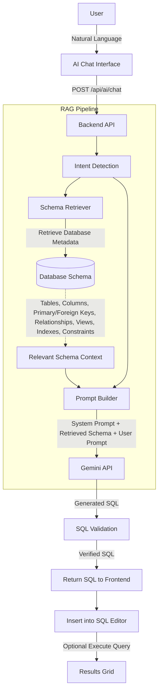
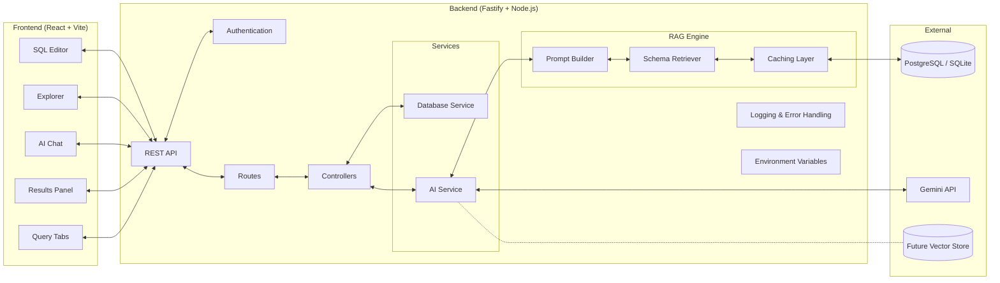
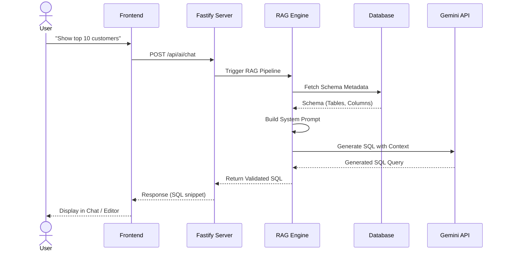

# SQLStudio

SQLStudio is a modern, web-based SQL Integrated Development Environment (IDE) built with a focus on developer experience and premium SaaS aesthetics. It allows users to write, execute, save, and track SQL queries against a true database engine directly from the browser.

## Features

- **Monaco Editor Integration**: Write SQL with full syntax highlighting, intelligent autocomplete, and a developer-first dark mode experience.
- **Real Database Execution**: Execute raw SQL queries directly against a persistent SQLite backend.
- **Database Schema Explorer**: Browse tables, columns, and primary keys from the live database schema.
- **Query History**: Automatically logs every query execution along with its status (success/error), execution time, and timestamp.
- **Saved Queries**: Persist your most important snippets into organized collections and re-run them with a single click.
- **Beautiful Dashboard**: Get a high-level overview of total connections, active users, query metrics, and recent connection activity.
- **Developer-First Design**: Built with pure CSS tokens, dark mode by default, and inspired by top-tier tools like VS Code, DataGrip, and Supabase Studio.

## 🧠 AI RAG Workflow

The SQL IDE uses Retrieval-Augmented Generation (RAG) to convert natural language into accurate SQL queries using the current database schema.



**Workflow Stages:**
- **Schema Retriever:** Dynamically extracts the active schema and metadata (tables, columns, relations) to prevent AI hallucinations.
- **Prompt Builder:** Constructs a highly specific system prompt containing the database structure and execution instructions.
- **Gemini API:** Processes the augmented prompt to generate syntactically correct and highly optimized SQL.
- **SQL Validation & Execution:** The generated query is verified and returned to the Monaco Editor, allowing the user to seamlessly execute and analyze the results.

## 🏗️ Project Architecture



## 🔄 Request Lifecycle



## 📁 Folder Structure

```text
backend/
├── src/
│   ├── config/
│   │   └── env.ts
│   ├── controllers/
│   │   └── ai.controller.ts
│   ├── rag/
│   │   ├── promptBuilder.ts
│   │   └── schemaRetriever.ts
│   ├── routes/
│   │   └── ai.routes.ts
│   ├── services/
│   │   └── ai.service.ts
│   ├── database.ts
│   ├── index.ts
│   ├── seed.ts
│   └── seed-metadata.ts
├── prisma/
│   └── schema.prisma
└── package.json

frontend/
├── src/
│   ├── components/
│   │   ├── chat/
│   │   │   ├── AIChatSidebar.tsx
│   │   │   └── ChatMessage.tsx
│   │   └── ui/
│   ├── pages/
│   │   └── SQLWorkspace.tsx
│   ├── store/
│   └── index.css
└── package.json
```

## ⚙️ AI Request Pipeline


## 💻 Technology Stack

| Category | Technology | Description |
| :--- | :--- | :--- |
| **Frontend** | React 18, Vite, TypeScript | High-performance SPA with fast HMR |
| **Styling** | Tailwind CSS, Lucide Icons | Utility-first CSS with dark mode tokens |
| **Editor** | Monaco Editor | VS Code engine with AI autocomplete |
| **Backend** | Fastify, Node.js | High-throughput async backend API |
| **Database** | PostgreSQL / SQLite | Primary datastore |
| **Authentication** | Custom / Mock Auth | Secure session management layer |
| **AI Model** | Google Gemini | Generative LLM for SQL synthesis |
| **RAG Engine** | Custom Context Builder | Extracts schema for context-aware queries |
| **Environment** | Dotenv, Vite Config | Centralized environment management |
| **Deployment** | Docker (Planned) | Containerized full-stack deployment |
| **Future** | Vector Store | Embeddings for highly complex semantic search |

## Tech Stack

### Frontend
- **Framework**: React 18 with Vite and TypeScript
- **Routing**: React Router DOM v6
- **State & Data Fetching**: TanStack React Query & Zustand
- **Editor**: `@monaco-editor/react`
- **Styling**: Tailwind CSS with a custom design system token architecture (`index.css`)
- **Icons**: Lucide React

### Backend
- **Framework**: Fastify with Node.js
- **Database Engine**: `better-sqlite3` and `PGlite` integration
- **ORM & Metadata Storage**: Prisma ORM with SQLite (`metadata.db`)
- **Runtime**: `tsx` for seamless TypeScript execution

## Getting Started

### Prerequisites
- Node.js (v18 or higher)
- npm

### Installation

1. **Clone the repository**
   ```bash
   git clone https://github.com/<YOUR_USERNAME>/<YOUR_REPO_NAME>.git
   cd SQL-editor
   ```

2. **Setup the Backend**
   ```bash
   cd backend
   npm install
   ```

   Configure environment variables:

   ```env
   GEMINI_API_KEY=
   DATABASE_URL="file:./metadata.db"
   PORT=3000
   ```

   **Initialize the Database & Start Server:**
   ```bash
   # Push the Prisma schema to generate the local SQLite database
   npx prisma db push
   
   # Seed the database with initial metadata (optional)
   npx tsx src/seed-metadata.ts
   
   # Start the backend server
   npm run dev
   ```
   The backend will run on `http://localhost:3000`.

3. **Setup the Frontend**
   Open a new terminal window:
   ```bash
   cd frontend
   npm install
   
   # Start the Vite development server
   npm run dev
   ```
   The frontend will run on `http://localhost:5173`.

## Usage
1. Open your browser to `http://localhost:5173`.
2. Navigate to the **Workspace** using the sidebar.
3. Write standard SQL (e.g., `CREATE TABLE`, `INSERT`, `SELECT`) in the Monaco editor.
4. Hit **Run Query** to view the tabular results.
5. Hit **Save** to persist a query to your library.
6. Check your **Dashboard**, **Query History**, and **Saved Queries** via the sidebar navigation.

## License
MIT License
