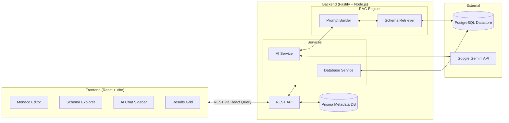

# SQLStudio Architecture

This document provides a comprehensive architectural overview of the SQLStudio project based on the current codebase.

## High-Level Overview

SQLStudio is a modern, web-based SQL Integrated Development Environment (IDE). It utilizes a separated frontend/backend architecture with a powerful Retrieval-Augmented Generation (RAG) pipeline to seamlessly integrate Google's Gemini AI for SQL generation, explanation, and optimization.

---

## 1. Frontend Architecture

The frontend is a single-page application built for high performance and a developer-first aesthetic.

**Core Technologies:**
- **Framework:** React 18, Vite, TypeScript
- **State Management & Fetching:** TanStack React Query (data fetching and caching), Zustand (global state)
- **Editor:** `@monaco-editor/react` (Provides VS Code-like syntax highlighting and AI autocomplete shortcuts)
- **Styling:** Tailwind CSS, `lucide-react` for iconography. Custom CSS variables (tokens) are heavily utilized for theming and dark mode.
- **Layout:** `react-resizable-panels` allows draggable, customizable layout panes similar to desktop IDEs.

**Key Components:**
- `SQLWorkspace`: The primary view orchestrating the layout, schema explorer, editor, and results.
- `AIChatSidebar`: A conversational interface to the Gemini API, allowing natural language to SQL generation.

---

## 2. Backend Architecture

The backend is an asynchronous, high-throughput API layer handling query execution, metadata storage, and AI processing.

**Core Technologies:**
- **Framework:** Fastify (Node.js)
- **Query Execution Datastore:** PostgreSQL (`information_schema` is heavily queried for schema reflection).
- **Metadata ORM:** Prisma ORM (Used to store `User`, `DatabaseConnection`, `QueryHistory`, `SavedQuery`, and `AiConversation` entities).
- **AI SDK:** `@google/genai` (Google Gemini SDK).

**Key Endpoints:**
- `/api/schema`: Reflects the database schema (tables, columns, primary keys) on-the-fly to keep the UI and AI in sync.
- `/api/query/execute`: Executes raw SQL against the primary datastore, computes execution time, formats columns/rows, and logs the execution to the Prisma history.
- `/api/ai/*` (`chat`, `explain`, `optimize`, `fix`): Routes dedicated to various AI tasks.

---

## 3. RAG Pipeline (AI Engine)

A defining feature of SQLStudio is its Retrieval-Augmented Generation (RAG) engine that prevents the AI from hallucinating tables or columns.

### Execution Flow:
1. **Schema Retrieval (`schemaRetriever.ts`):** 
   - Dynamically extracts the active schema metadata from `information_schema`.
   - Utilizes a simple 5-minute memory cache (`cachedSchema`) to prevent hammering the database on every AI request.
2. **Context Building (`promptBuilder.ts`):** 
   - Constructs a strict System Prompt.
   - Embeds the exact DDL schema (Tables, Columns, Data Types, Primary Keys) into the prompt.
   - Enforces strict rules (e.g., "Never hallucinate tables", "Prefer JOIN over subqueries").
3. **Generation (`ai.service.ts`):** 
   - Fetches historical conversation context from Prisma to maintain conversational memory.
   - Makes a deterministic call (`temperature: 0.1`) to `gemini-2.5-flash`.
   - The verified response is logged and returned to the frontend.

---

## 4. Database Strategy

SQLStudio utilizes a **dual-database strategy**:
1. **Execution Database:** The actual database being queried by the user. Handled via direct database drivers (e.g., querying `information_schema`).
2. **Metadata Database (Prisma):** A separate database (usually SQLite based on the repository instructions) that acts as the control plane. It stores application state:
   - Chat histories (`AiConversation`, `AiChatMessage`)
   - Query histories (`QueryHistory`)
   - Saved SQL Snippets (`SavedQuery`)
   - Dashboard metrics

> [!NOTE]
> This separation of concerns ensures that the execution engine is not bogged down by application-level data and allows SQLStudio to safely manage multiple distinct connections in the future.
