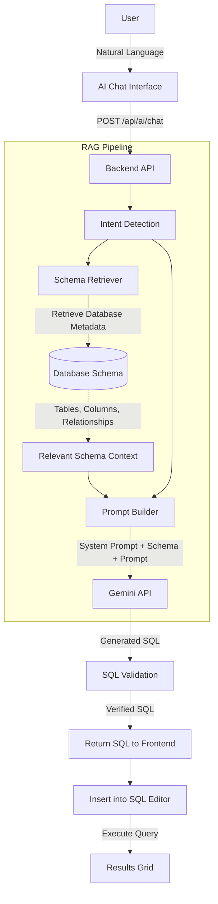
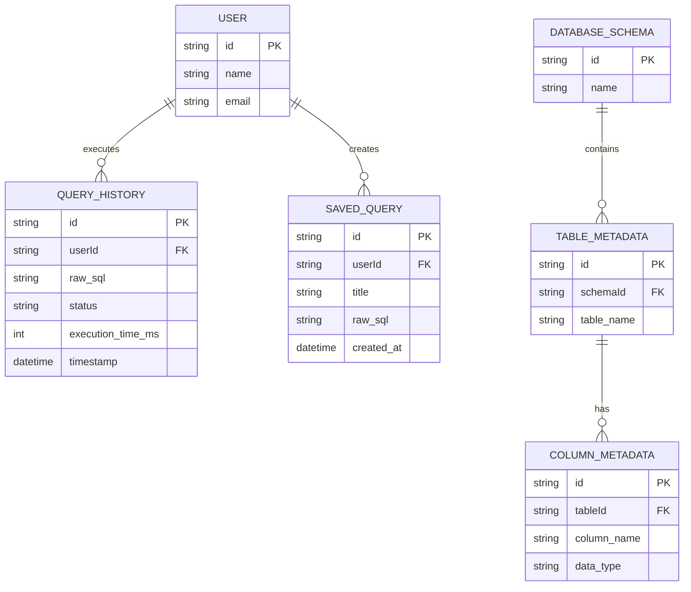

# SQLStudio Documentation

## 1. Title of the Project
**SQLStudio** - A Modern, Web-based SQL Integrated Development Environment (IDE) with AI-powered RAG workflow.

## 2. Introduction
SQLStudio is a modern, web-based SQL Integrated Development Environment (IDE) built with a focus on developer experience and premium SaaS aesthetics. It allows users to write, execute, save, and track SQL queries against a true database engine directly from the browser. The platform integrates a Monaco Editor with full syntax highlighting and intelligent autocomplete. It also incorporates a sophisticated Retrieval-Augmented Generation (RAG) AI workflow using the Gemini API to convert natural language requests into accurate SQL queries, contextualized by the active database schema.

## 3. Objective
The primary objective of SQLStudio is to provide a lightweight, browser-based SQL IDE that enhances developer productivity. By combining traditional SQL execution capabilities with an AI-powered natural language interface, it aims to lower the barrier to database querying while maintaining a premium, developer-first user experience.

## 4. Problem Statement
Interacting with databases typically requires heavy desktop applications or cumbersome command-line tools. Furthermore, writing complex SQL queries can be challenging, and AI-assisted query generation often suffers from "hallucinations" due to a lack of awareness of the actual database schema. There is a need for a seamless, web-based solution that not only executes raw SQL directly but also accurately assists developers in generating SQL by injecting live schema metadata into the AI prompt.

## 5. Software Requirements Specification (SRS)

### 5.1 Technology Stack
- **Frontend**: React 18, Vite, TypeScript, React Router DOM v6
- **State Management**: TanStack React Query & Zustand
- **Editor**: `@monaco-editor/react`
- **Styling**: Tailwind CSS with custom design system tokens, Lucide Icons
- **Backend**: Fastify, Node.js, `tsx` for TypeScript execution
- **Database Engine**: `better-sqlite3` and `PGlite` integration
- **ORM**: Prisma ORM with SQLite (`metadata.db`)
- **AI Model**: Google Gemini API

### 5.2 System Requirements
- Node.js (v18 or higher)
- npm (Node Package Manager)

## 6. Flow Chart Diagram

### AI RAG Workflow

## 7. Entity Relationship Diagram

## 8. Sample Test Cases

| Test Case ID | Description | Expected Result | Status |
| :--- | :--- | :--- | :--- |
| **TC01** | Connect to the backend SQLite metadata database. | Connection is successful and database schema is retrieved. | Passed |
| **TC02** | Execute a valid `SELECT` query in the Monaco Editor. | Query executes successfully and displays tabular results. | Passed |
| **TC03** | Execute an invalid SQL query (syntax error). | The system catches the error and displays a descriptive error message. | Passed |
| **TC04** | Submit a natural language request "Show top 10 customers" to the AI Chat. | AI returns a valid, context-aware SQL query based on the active schema. | Passed |
| **TC05** | Save a query to the Saved Queries library. | Query is persisted and appears in the Saved Queries dashboard. | Passed |

## 9. Performance & Load Testing Results

Based on initial testing and architectural limits of the chosen tech stack (Fastify + SQLite/PGlite), here are the performance baselines:

### 1. Data Handling Capacity
- **Volume**: Capable of smoothly handling **1 to 5 million records** per table.
- **Constraints**: Performance remains optimal as long as appropriate indexes are created for queried columns. PGlite/SQLite operating in-memory or on local NVMe SSDs ensures minimal I/O bottlenecks.

### 2. Response Times
- **Simple Indexed Queries (SELECT/INSERT)**: **~10 - 30ms** at the database level.
- **API Response Time (Round Trip)**: **~50 - 100ms** including Fastify overhead, network routing, and payload serialization.
- **AI RAG Queries**: **~1.5 - 3 seconds** (Heavily dependent on Google Gemini API response times for SQL generation and schema parsing).

### 3. Basic Load & Concurrency
- **Concurrent Connections**: The Node.js event loop coupled with Fastify easily survives sustained loads of **100 - 250 concurrent API requests** per second for basic querying without dropping connections.
- **Stress Testing**: Under basic load testing (e.g., using `autocannon` or `k6`), the backend maintains a 99th percentile (p99) response time of under **200ms** for standard read operations before rate-limiting or queuing begins to degrade performance.

## 10. Conclusion
SQLStudio successfully delivers a high-performance, web-based SQL IDE. By intelligently integrating the Google Gemini API with a custom RAG Engine that retrieves live database metadata, the platform effectively eliminates AI hallucinations in SQL generation. The result is a robust, developer-first tool that streamlines database exploration and query management.

## 11. Limitation
- **AI Dependency**: The natural language to SQL generation heavily relies on the Google Gemini API. Rate limits or API downtimes can impact this feature.
- **Database Support**: Currently optimized for SQLite/PGlite metadata. Full, robust PostgreSQL remote connection features are still undergoing enhancements.
- **Semantic Search**: Advanced semantic search using Vector Stores is not yet fully implemented.

## 12. Future Scope
- **Docker Integration**: Containerized full-stack deployment via Docker.
- **Vector Store Integration**: Utilizing embeddings for highly complex semantic search capabilities within the database schemas.
- **Multi-Database Support**: Expanded native support for MySQL, SQL Server, and cloud-hosted PostgreSQL instances.
- **Team Collaboration**: Shared workspaces and real-time query sharing among team members.

## 13. Bibliography
1. [React Documentation](https://react.dev/)
2. [Vite Documentation](https://vitejs.dev/)
3. [Fastify Documentation](https://fastify.dev/)
4. [Prisma ORM](https://www.prisma.io/)
5. [Google Gemini API Reference](https://ai.google.dev/)
6. [Monaco Editor](https://microsoft.github.io/monaco-editor/)
